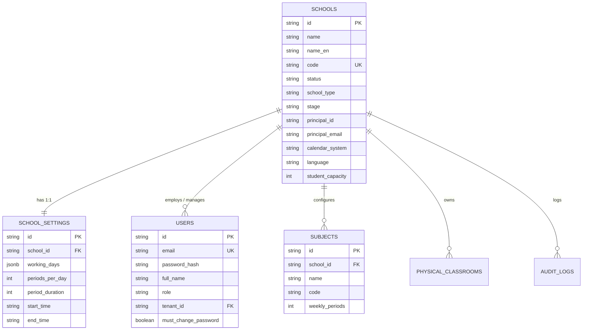
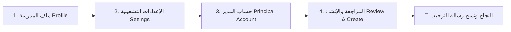
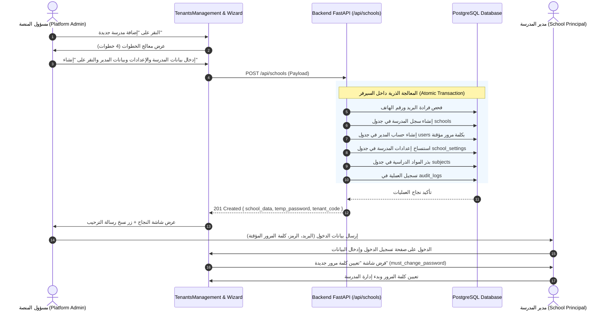

# دليل المعمارية البرمجية الشامل لإضافة وإدارة المدارس (School Management & Onboarding)
**نظام نَسَّق (NASSAQ) — من منظور لوحة تحكم مسؤول المنصة (Platform Admin Role)**

---

## 📑 فهرس المحتويات
1. [نظرة عامة على معمارية المستأجرين (Multi-Tenancy Architecture)](#1-نظرة-عامة-على-معمارية-المستأجرين-multi-tenancy-architecture)
2. [قواعد البيانات وجداول النظام (Database Schema & Models)](#2-قواعد-البيانات-وجداول-النظام-database-schema--models)
   - [2.1 جدول المدارس والمستأجرين (`schools`)](#21-جدول-المدارس-والمستأجرين-schools)
   - [2.2 جدول إعدادات المدرسة التشغيلية (`school_settings`)](#22-جدول-إعدادات-المدرسة-التشغيلية-school_settings)
   - [2.3 جدول المستخدمين وحساب المدير (`users`)](#23-جدول-المستخدمين-وحساب-المدير-users)
   - [2.4 جدول المواد التلقائية (`subjects`)](#24-جدول-المواد-التلقائية-subjects)
   - [2.5 جدول الفصول والقاعات الفيزيائية (`physical_classrooms`)](#25-جدول-الفصول-والقاعات-الفيزيائية-physical_classrooms)
   - [2.6 جدول سجلات التدقيق والعمليات (`audit_logs`)](#26-جدول-سجلات-التدقيق-والعمليات-audit_logs)
   - [2.7 مخطط العلاقات (Entity Relationship Diagram - ERD)](#27-مخطط-العلاقات-entity-relationship-diagram---erd)
3. [واجهات البرمجة الخلفية (Backend APIs & Endpoints)](#3-واجهات-البرمجة-الخلفية-backend-apis--endpoints)
   - [3.1 إنشاء مدرسة جديدة (`POST /api/schools`)](#31-إنشاء-مدرسة-جديدة-post-apischools)
   - [3.2 دورة حياة المستأجر (التفعيل / التعليق / المسودة)](#32-دورة-حياة-المستأجر-التفعيل--التعليق--المسودة)
   - [3.3 تفاصيل وإحصائيات المدرسة وإعادة ضبط بيانات الدخول](#33-تفاصيل-وإحصائيات-المدرسة-وإعادة-ضبط-بيانات-الدخول)
4. [معمارية الواجهة الأمامية للمسؤول (Frontend Architecture - Admin Role)](#4-معمارية-الواجهة-الأمامية-للمسؤول-frontend-architecture---admin-role)
   - [4.1 الصفحات الرئيسية لإدارة المدارس](#41-الصفحات-الرئيسية-لإدارة-المدارس)
   - [4.2 معالج إنشاء المدرسة السحابي (`CreateSchoolWizard.jsx`)](#42-معالج-إنشاء-المدرسة-السحابي-createschoolwizardjsx)
   - [4.3 ميزة استعراض المدرسة والدخول بصلاحية المدير (`Impersonation / Preview`)](#43-ميزة-استعراض-المدرسة-والدخول-بصلاحية-المدير-impersonation--preview)
5. [مخطط التسلسل التفاعلي للعملية (End-to-End Sequence Diagram)](#5-مخطط-التسلسل-التفاعلي-للعملية-end-to-end-sequence-diagram)
6. [إرشادات الصيانة والتطوير المستقبلي (Best Practices & Extensibility)](#6-إرشادات-الصيانة-والتطوير-المستقبلي-best-practices--extensibility)

---

## 1. نظرة عامة على معمارية المستأجرين (Multi-Tenancy Architecture)

يعتمد نظام **نَسَّق (NASSAQ)** على معمارية **Multi-Tenant System** ذات قاعدة بيانات مشتركة مع عزل منطقي صارم (**Logical Tenant Isolation**).

* كل مدرسة تمثل **مستأجراً مستقلاً (Tenant)** يحمل معرّفاً فريداً (`school_id`).
* جميع الجداول والبيانات التشغيلية (الطلاب، المعلمون، الحصص، الجداول، الغياب، الدرجات) ترتبط إجبارياً بحقل `school_id` أو `tenant_id`.
* يقوم مسؤول المنصة (**`platform_admin`**) بإنشاء المستأجر وتخصيص رمزه (`code`)، وإعداد حسابه القيادي، وتهيئة بنيته التحتية الأولية بضغطة زر واحدة.

---

## 2. قواعد البيانات وجداول النظام (Database Schema & Models)



---

### 2.1 جدول المدارس والمستأجرين (`schools`)
الكيان الجذري لكل مدرسة مسجلة في النظام.

* **اسم الجدول في DB:** `schools`
* **المسار:** `backend/src/modules/schools/entities/schools_entity.py`

| الحقل (Column) | النوع (Type) | الوصف والأهمية |
| :--- | :--- | :--- |
| `id` | `String (UUID)` | المعرف الأساسي والفريد للمدرسة (Primary Key). |
| `name` | `String` | الاسم الرسمي للمدرسة بالعربية (مثال: "مدرسة الأندلس الأهلية"). |
| `name_en` | `String` | الاسم باللغة الإنجليزية. |
| `code` | `String (Unique, Index)` | الرمز التعريفي الفريد للمدرسة (مثال: `SA-RUH-0102` أو رمز مخصص) يُستخدم كمعرّف لتسجيل الدخول والربط. |
| `email` | `String` | البريد الإلكتروني الرسمي للمدرسة. |
| `phone` | `String` | رقم الهاتف الأرضي أو المحمول للتواصل مع المدرسة. |
| `address` / `city` / `region` | `String` | الموقع الجغرافي: العنوان، المدينة (الرياض، جدة، الدمام...)، والمنطقة. |
| `country` | `String` | الدولة (افتراضياً: `"SA"` المملكة العربية السعودية). |
| `logo_url` | `String` | رابط شعار المدرسة المرفوع. |
| `status` | `String (Index)` | حالة المستأجر: `"active"` (نشط), `"setup"` (قيد التهيئة), `"suspended"` (موقوف), `"archived"` (مؤرشف). |
| `school_type` | `String` | نوع المدرسة: `"public"` (حكومية), `"private"` (أهلية), `"international"` (عالمية). |
| `stage` | `String` | المرحلة الدراسية: `"primary"` (ابتدائية), `"intermediate"` (متوسطة), `"secondary_general"` (ثانوية عامة), `"secondary_pathways"` (ثانوية مسارات), `"school_complex"` (مجمع مدارس). |
| `educational_pathway` | `String` | المسار التعليمي للمرحلة الثانوية (عام، علوم حاسب وهندسة، صحة وحياة، إدارة أعمال، شرعي). |
| `gender` | `String` | نوع الطلاب: `"boys"` (بنين), `"girls"` (بنات), `"mixed"` (مشترك). |
| `language` | `String` | اللغة الافتراضية للواجهة والتقارير (`"ar"` أو `"en"`). |
| `calendar_system` | `String` | النظام التقويمي: `"hijri_gregorian"`, `"gregorian_hijri"`, `"hijri"`, `"gregorian"`. |
| `student_capacity` | `Integer` | السعة الاستيعابية القصوى للطلاب. |
| `current_students` / `teachers` | `Integer` | عدادات سريعة لعدد الطلاب والمعلمين المسجلين حالياً. |
| `principal_id` | `String` | معرف حساب مدير المدرسة المرتبط. |
| `principal_name` / `email` / `phone` | `String` | بيانات التواصل الأساسية لمدير المدرسة. |
| `tenant_type` | `String` | تصنيف المستأجر: `"production"` (مدرسة فعلية), `"demo"` (تجريبية), `"trial"` (فترة تجربة). |
| `setup_completed` | `Boolean` | يحدد هل أتمت المدرسة خطوات المعالج والتهيئة الأولية. |
| `health_score` | `Float` | مؤشر جاهزية وصحة البيانات الأكاديمية للمدرسة (0 - 100%). |
| `subscription_start` / `end` | `DateTime` | تاريخ بدء وانتهاء الاشتراك السحابي. |
| `created_by` | `String` | معرف مسؤول المنصة (`platform_admin`) الذي أنشأ المدرسة. |
| `created_at` / `updated_at` | `DateTime` | طوابع التدقيق الزمني. |

---

### 2.2 جدول إعدادات المدرسة التشغيلية (`school_settings`)
الإعدادات الخاصة بتوقيت اليوم الدراسي والجدول واللوائح الخاصة بكل مدرسة.

* **اسم الجدول في DB:** `school_settings`
* **المسار:** `backend/src/modules/schools/entities/schools_entity.py`
* **العلاقة:** علاقة واحد لواحد (`One-to-One`) مع جدول `schools`.

| الحقل (Column) | النوع (Type) | الوصف والأهمية |
| :--- | :--- | :--- |
| `id` | `String (UUID)` | المعرف الفريد للإعدادات (`settings-{school_id}`). |
| `school_id` | `String (FK, Unique)` | الربط بالمدرسة (مع خاصية `ondelete="CASCADE"` لحذف الإعدادات عند حذف المدرسة). |
| `working_days` | `JSONB` | أيام الدراسة الأسبوعية (افتراضياً: `["sunday", "monday", "tuesday", "wednesday", "thursday"]`). |
| `periods_per_day` | `Integer` | عدد الحصص الدراسية في اليوم الواحد (افتراضياً: 7 حصص). |
| `period_duration` | `Integer` | مدة الحصة الواحدة بالدقائق (افتراضياً: 45 دقيقة). |
| `break_duration` | `Integer` | مدة الفسحة المدرسية بالدقائق (افتراضياً: 15 دقيقة). |
| `start_time` / `end_time` | `String` | مواعيد بدء الطابور الصباحي وانتهاء الدوام (`"07:00"` إلى `"14:00"`). |
| `grading_system` | `String` | نظام التقييم والرصد (`"percentage"` النسبة المئوية، `"gpa"` المعدل التراكمي، `"competency"` الكفايات). |
| `custom_settings` | `JSONB` | إعدادات مخصصة لحصص الانتظار، وضوابط الجداول، وبوابة أولياء الأمور. |

---

### 2.3 جدول المستخدمين وحساب المدير (`users`)
عند إنشاء المدرسة، ينشئ النظام تلقائياً حساب المدير الأول (`School Principal`).

* **اسم الجدول في DB:** `users`
* **المسار:** `backend/src/modules/users/entities/users_entity.py`

| الحقل (Column) | القيمة عند إنشاء مدرسة جديدة |
| :--- | :--- |
| `id` | `UUID` جديد. |
| `email` | البريد الإلكتروني للمدير المُدخل في المعالج (`principal_email`). |
| `password_hash` | كلمة مرور مؤقتة عشوائية مشفرة بـ `bcrypt` (12 خانة تحتوي أرقاماً ورموزاً). |
| `full_name` | الاسم الكامل للمدير (`principal_name`). |
| `role` | الدور القيادي: `"school_principal"`. |
| `tenant_id` | معرّف المدرسة المنشأة حديثاً (`school_id`). |
| `phone` | رقم جوال المدير. |
| `is_active` | `True` (الحساب مفعل فوراً). |
| `must_change_password` | `True` (يُجبر المدير على تعيين كلمة مرور جديدة عند أول تسجيل دخول). |

---

### 2.4 جدول المواد التلقائية (`subjects`)
يقوم النظام بعملية **Seed** تلقائية للكتالوج القياسي للمواد الدراسية المتوافقة مع المناهج السعودية (لغة عربية، رياضيات، علوم، لغة إنجليزية، تربية إسلامية، دراسات اجتماعية، حاسب آلي، تربية بدنية، فنية) فور إنشاء المدرسة.
* **المصدر:** `src/common/constants/default_subjects.py`
* **الهدف:** تمكين المدرسة من البدء الفوري في إسناد الحصص وبناء الجداول دون الحاجة لإدخال المواد يدوياً من الصفر.

---

### 2.5 جدول الفصول والقاعات الفيزيائية (`physical_classrooms`)
يخزن البنية التحتية والمباني المدرسية:
* **الحقول:** `id`, `tenant_id` (`school_id`), `name` (اسم القاعة/المعمل), `building` (المبنى), `floor` (الدور), `room_type` (فصل عادي، معمل حاسب، معمل علوم، مكتبة، صالة رياضية), `capacity` (سعة القاعة), `has_smartboard`, `has_projector`, `has_ac`.

---

### 2.6 جدول سجلات التدقيق والعمليات (`audit_logs`)
يوثق كل حركة إنشاء وتعديل يقوم بها مسؤول المنصة لضمان النزاهة والأمان:
* يسجل العملية `TENANT_CREATED` مع كامل البيانات الوصفية واسم المسؤول الذي أنشأها.
* يسجل العملية `USER_CREATED` لحساب المدير المنشأ.

---

## 3. واجهات البرمجة الخلفية (Backend APIs & Endpoints)

تتمركز المتحكمات في:
`backend/src/modules/schools/controllers/school_routes_mod.py`

```mermaid
flowchart TD
    AdminClient[Platform Admin Frontend] -->|1. POST /api/schools| CreateEndpoint[school_routes_mod.py]
    CreateEndpoint -->|2. Validate Uniqueness| UsersTable[(users)]
    CreateEndpoint -->|3. Generate Unique Code| CodeGen[insert_school_with_unique_code]
    CreateEndpoint -->|4. Insert School| SchoolsTable[(schools)]
    CreateEndpoint -->|5. Create Principal Account| UsersTable
    CreateEndpoint -->|6. Clone Settings Template| SettingsTable[(school_settings)]
    CreateEndpoint -->|7. Seed Default Subjects| SubjectsTable[(subjects)]
    CreateEndpoint -->|8. Log Audit Record| AuditEngine[Audit Engine]
    CreateEndpoint -->>|9. Return School & Temp Credentials| AdminClient
```

---

### 3.1 إنشاء مدرسة جديدة (`POST /api/schools`)
الواجهة البرمجية المسؤولة عن تسجيل وإنشاء المدرسة بالكامل.
* **الصلاحية المطلوبة (RBAC):** `PLATFORM_ADMIN` حصراً.
* **جسم الطلب (Request Body - `SchoolCreate`):**
```json
{
  "name": "مدرسة الرياض النموذجية",
  "name_en": "Al-Riyadh Model School",
  "code": "SA-RUH-501", 
  "country": "SA",
  "city": "الرياض",
  "region": "المنطقة الوسطى",
  "address": "حي النرجس، شارع أنس بن مالك",
  "email": "info@riyadh-school.edu.sa",
  "language": "ar",
  "calendar_system": "hijri_gregorian",
  "school_type": "private",
  "stage": "primary",
  "educational_pathway": "",
  "student_capacity": 600,
  "principal_name": "عبدالعزيز السعدون",
  "principal_email": "principal@riyadh-school.edu.sa",
  "principal_phone": "0501234567",
  "principal_mobile": "0501234567"
}
```

* **العمليات الذكية المنفذة في الباك إند:**
  1. **التحقق من عدم التكرار:** فحص البريد الإلكتروني ورقم هاتف المدير لمنع تكرار الحسابات.
  2. **توليد أو تثبيت كود المدرسة (`School Code`):** إذا لم يُدخل المسؤول كوداً مخصصاً، يقوم الباك إند بتوليد كود مميز يعتمد على الدولة والمدينة ورقم تسلسلي غير قابل للتكرار (Collision-free).
  3. **إنشاء حساب المدير بكلمة مرور عشوائية مؤقتة:** تشفير كلمة المرور وتعيين `must_change_password: true`.
  4. **استنساخ إعدادات المدرسة الافتراضية:** نسخ القالب النموذجي إلى جدول `school_settings`.
  5. **حقن المواد الدراسية (`Seed Subjects`):** إدراج مواد المرحلة الدراسية المحددة تلقائياً.
  6. **توثيق العملية في سجلات التدقيق:** `audit_engine.log_data_change`.
  7. **الرد ببيانات المدرسة مع كلمة المرور المؤقتة:** لتمكين مسؤول المنصة من نسخ رسالة الترحيب وإرسالها للمدير فوراً.

---

### 3.2 دورة حياة المستأجر (التفعيل / التعليق / المسودة)

| المسار (Endpoint) | الطريقة | الوصف |
| :--- | :--- | :--- |
| `GET /api/schools` | `GET` | جلب قائمة كافة المدارس مع مرشحات البحث بالحالة والمدينة والمرحلة. |
| `POST /api/schools/draft` | `POST` | حفظ مدرسة غير مكتملة كمسودة للرجوع إليها لاحقاً (`status: 'setup'`). |
| `DELETE /api/schools/{id}/draft` | `DELETE` | حذف مسودة مدرسة لم يكتمل إعدادها. |
| `POST /api/schools/{id}/suspend` | `POST` | إيقاف مؤقت للمدرسة (يمنع دخول المعلمين والطلاب والمدير للمنصة). |
| `POST /api/schools/{id}/activate` | `POST` | إعادة تفعيل مدرسة موقوفة واستئناف عملها. |
| `PUT /api/schools/{id}` | `PUT` | تحديث بيانات وملف المدرسة العام وإعداداتها. |

---

### 3.3 تفاصيل وإحصائيات المدرسة وإعادة ضبط بيانات الدخول

| المسار (Endpoint) | الطريقة | الوصف |
| :--- | :--- | :--- |
| `GET /api/schools` | `GET` | قائمة المدارس مع دعم الترقيم والبحث والفلترة الفورية وحساب نسب الإعداد. |
| `GET /api/schools/numbers` | `GET` | إحصائيات مركز القيادة الموحد لجميع المدارس (نشطة، موقوفة، قيد الإعداد، إجمالي الطلاب والمعلمين والفصول). |

---

## 4. معمارية الواجهة الأمامية للمسؤول (Frontend Architecture - Admin Role)

تقع صفحات ومكونات إدارة المدارس الخاصة بالمسؤول في:
`frontend/src/features/platform/` و `frontend/src/features/teachers/components/wizards/`

```
frontend/src/features/
├── platform/
│   └── pages/
│       ├── TenantsManagement.jsx           # الصفحة الرئيسية لإدارة المستأجرين (Grid / Table)
│       ├── PlatformSchoolsPage.jsx         # جدول المدارس المفصل مع مقاييس الصحة
│       └── PlatformSchoolDetailPage.jsx    # الملف التفصيلي للمدرسة وإدارة الاشتراك والبيانات
└── teachers/
    └── components/
        └── wizards/
            └── CreateSchoolWizard.jsx       # معالج إنشاء المدرسة المكون من 4 خطوات
```

---

### 4.1 الصفحات الرئيسية لإدارة المدارس

1. **`TenantsManagement.jsx`**:
   - واجهة عصرية تدعم العرض الشبكي (`Grid View`) بنمط البطاقات أو العرض الجدولي (`List View`).
   - مؤشرات سريعة أعلى الصفحة: إجمالي المدارس، المدارس النشطة، المدارس قيد الإعداد، المدارس الموقوفة.
   - مرشحات تفاعلية للبحث بالاسم، المدينة، المنطقة، والحالة.
   - أزرار التحكم السريع: تفعيل، إيقاف، حذف المسودة، استعراض المدرسة.
   - زر رئيسي: **"إضافة مدرسة جديدة"** الذي يطلق نافذة `CreateSchoolWizard`.

2. **`PlatformSchoolDetailPage.jsx`**:
   - صفحة التحكم الفردية بالمدرسة للمسؤول:
     - تبويب الملف التعريفي واللوجو والعناوين.
     - تبويب إدارة الاشتراكات وصلاحيات التراخيص وتاريخ الانتهاء.
     - تبويب مؤشر صحة المدرسة (`Health Score`) والجاهزية الأكاديمية.
     - تبويب إدارة بيانات المدير مع زر **"إعادة إرسال بيانات الدخول"**.
     - منطقة الخطر (`Danger Zone`): للأرشفة أو الإيقاف النهائي.

---

### 4.2 معالج إنشاء المدرسة السحابي (`CreateSchoolWizard.jsx`)

معالج خطوة بخطوة (`Step-by-Step Wizard`) منظم في 4 مراحل لضمان تجربة مستخدم سلسة وخالية من الأخطاء:



#### المراحل الأربعة للمعالج بالتفصيل:

* **الخطوة 1: ملف المدرسة (School Profile)**:
  * اسم المدرسة بالعربية والإنجليزية.
  * الدولة (افتراضياً السعودية)، المدينة، المنطقة، العنوان التفصيلي.
  * البريد الإلكتروني للمدرسة، اسم المدير وجواله للتواصل المبدئي.
  * رفع الشعار المعتمد للمدرسة.
* **الخطوة 2: الإعدادات التشغيلية (Operating Settings)**:
  * لغة الواجهة الأساسية (`العربية` / `الإنجليزية`).
  * النظام التقويمي (`هجري + ميلادي`، `ميلادي + هجري`...).
  * نوع المدرسة (`حكومية` / `أهلية`).
  * المرحلة التعليمية (`ابتدائية`، `متوسطة`، `ثانوية عامة`، `ثانوية مسارات`، `مجمع مدارس`).
  * المسار التعليمي (في حال اختيار ثانوية مسارات: مسار عام، حاسب وهندسة، صحة وحياة، أعمال، شرعي).
  * نظام التقييم والدرجات.
* **الخطوة 3: حساب المدير (Principal Account)**:
  * الاسم الكامل لمدير المدرسة.
  * البريد الإلكتروني الرسمي (الذي سيُستخدم كاسم مستخدم لتسجيل الدخول).
  * رقم الهاتف الأساسي ورقم الهاتف الإضافي.
* **الخطوة 4: المراجعة والتأكيد (Review & Confirm)**:
  * بطاقة ملخصة شاملة لجميع البيانات المدخلة قبل الإرسال.
  * معالجة الأخطاء الذكية: في حال وجود تكرار في البريد أو الهاتف أو الرمز، يرجع المعالج تلقائياً للخطوة المعنية مع تلوين الحقل باللون الأحمر وتركيز المؤشر عليه (`Auto-focus`).
* **شاشة النجاح النهائية (Onboarding Success Dialog)**:
  * عرض كود المدرسة المولد (`School Code`).
  * عرض البريد الإلكتروني وكلمة المرور المؤقتة (`Temporary Password`).
  * **زر "نسخ رسالة الترحيب" (`Copy Welcome Message`)**: ينسخ رسالة واتساب/إيميل جاهزة ومنسقة بجميع بيانات الدخول والرابط لإرسالها لمدير المدرسة فوراً.

---

### 4.3 ميزة استعراض المدرسة والدخول بصلاحية المدير (`Impersonation / Preview`)

يوفر النظام لمسؤول المنصة القدرة على فتح لوحة تحكم مدير أي مدرسة لمعاينتها وحل أي مشكلة تقنية دون الحاجة لطلب كلمة مرور المدير:
* يتم ذلك عبر الخطاف (Hook): **`usePlatformAdminSchoolPreview.js`**.
* يقوم المسؤول بالضغط على زر **"معاينة المدرسة"** في بطاقة المدرسة.
* يقوم النظام بضبط سياق المدرسة في الـ Header (`X-School-Context: school_id`) وتوجيه المسؤول إلى لوحة القيادة `/principal/dashboard` مع شريط تنبيه علوي يوضح أنه في "وضع الاستعراض كمسؤول منصة".

---

## 5. مخطط التسلسل التفاعلي للعملية (End-to-End Sequence Diagram)

يوضح المخطط التالي دورة حياة إضافة المدرسة كاملة من نقرة المسؤول وحتى تسجيل دخول المدير:



---

## 6. إرشادات الصيانة والتطوير المستقبلي (Best Practices & Extensibility)

عند إضافة حقول جديدة أو توسيع معالج المدارس:
1. **سلامة العزل (Tenant Isolation):** تأكد دائماً من وجود `school_id` أو `tenant_id` كقيد أجنبي في أي جدول جديد يتبع المدرسة.
2. **استخدام المعاملات الذرية (Transactions):** يجب أن تتم خطوات إنشاء المدرسة، حساب المدير، والإعدادات، وبذر المواد داخل Transaction موحد حتى لا تتبقى مدرسة فارغة بدون مدير أو بدون مواد في حال حدوث انقطاع في الشبكة.
3. **تكامل التدقيق (Audit Logging):** أي تعديل على حالة المدرسة (تعليق / تفعيل / تغيير مدير) يجب أن يمر عبر `audit_engine.log_data_change`.
4. **تطابق الـ DTOs:** الحفاظ على تطابق نماذج Pydantic في `backend/src/modules/schools/dto/` مع حقول React Form في `CreateSchoolWizard.jsx`.

---

> 🎯 **ملخص:** يوفر هذا الدليل المرجع الفني المتكامل لكل ما يتعلق بإنشاء وإدارة المدارس من منظور مسؤول النظام وقواعد البيانات وواجهات البرمجة والواجهة الأمامية.
