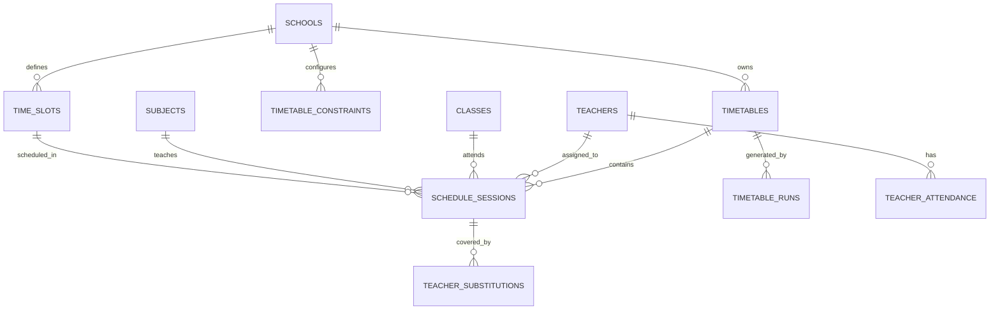
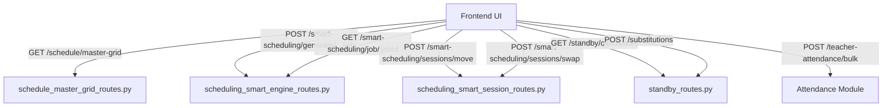
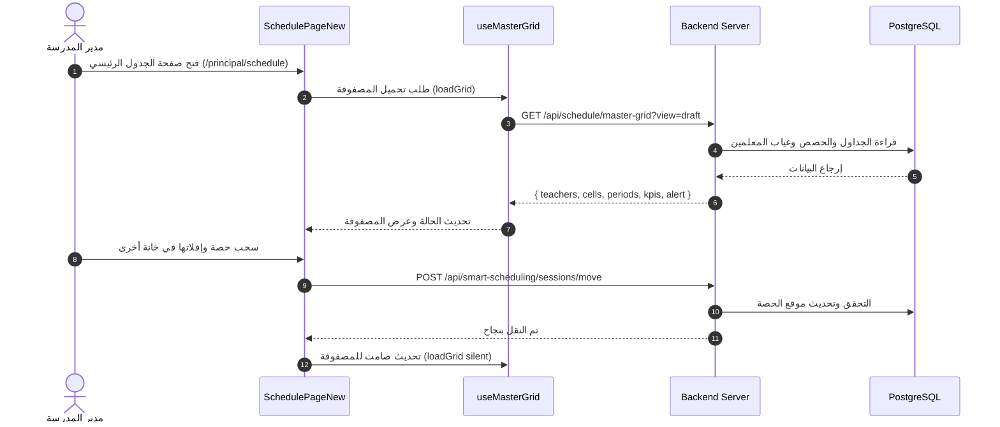
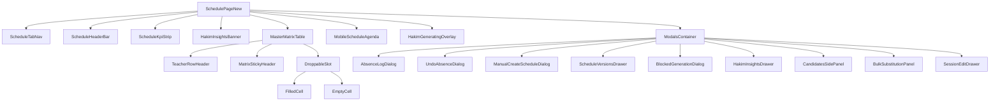

# دليل المعمارية وخطة إعادة الهيكلة الشاملة لنظام الجداول الذكية (Schedule Feature)
**نظام نَسَّق (NASSAQ) لإدارة المدارس والعمليات التعليمية**

---

## 📑 فهرس المحتويات
1. [نظرة عامة على النظام (Overview)](#1-نظرة-عامة-على-النظام-overview)
2. [قواعد البيانات وجداول النظام (Database Schema & Models)](#2-قواعد-البيانات-وجداول-النظام-database-schema--models)
   - [2.1 جدول الجداول المدرسية (`timetables`)](#21-جدول-الجداول-المدرسية-timetables)
   - [2.2 جدول حصص الجدول (`schedule_sessions` / `timetable_sessions`)](#22-جدول-حصص-الجدول-schedule_sessions--timetable_sessions)
   - [2.3 جدول الفترات الزمنية والحصص (`time_slots`)](#23-جدول-الفترات-الزمنية-والحصص-time_slots)
   - [2.4 جدول مهام التوليد الذكي (`timetable_runs`)](#24-جدول-مهام-التوليد-الذكي-timetable_runs)
   - [2.5 جدول القيود والاشتراطات (`timetable_constraints`)](#25-جدول-القيود-والاشتراطات-timetable_constraints)
   - [2.6 الجداول المساعدة والارتباطات (Supporting Entities)](#26-الجداول-المساعدة-والارتباطات-supporting-entities)
   - [2.7 مخطط العلاقات (Entity Relationship Diagram)](#27-مخطط-العلاقات-entity-relationship-diagram)
3. [واجهات البرمجة الخلفية (Backend APIs & Endpoints)](#3-واجهات-البرمجة-الخلفية-backend-apis--endpoints)
   - [3.1 مصفوفة العرض الرئيسية (Master Grid Endpoints)](#31-مصفوفة-العرض-الرئيسية-master-grid-endpoints)
   - [3.2 محرك التوليد الذكي والنسخ (Smart Generation & Lifecycle)](#32-محرك-التوليد-الذكي-والنسخ-smart-generation--lifecycle)
   - [3.3 إدارة الحصص والتعديل اليدوي (Session Mutations & DND)](#33-إدارة-الحصص-والتعديل-اليدوي-session-mutations--dnd)
   - [3.4 جدول حصص الانتظار والبدلاء (Standby Roster & Substitutions)](#34-جدول-حصص-الانتظار-والبدلاء-standby-roster--substitutions)
   - [3.5 حضور المعلمين والفترات الزمنية (Attendance & Time Slots)](#35-حضور-المعلمين-والفترات-الزمنية-attendance--time-slots)
4. [معمارية الواجهة الأمامية الحالية (Frontend Architecture)](#4-معمارية-الواجهة-الأمامية-الحالية-frontend-architecture)
   - [4.1 تشريح الملف الرئيسي `SchedulePageNew.jsx` والمشاكل الحالية](#41-تشريح-الملف-الرئيسي-schedulepagenewjsx-والمشاكل-الحالية)
   - [4.2 المكونات الفرعية الحالية في `components/schedule/`](#42-المكونات-الفرعية-الحالية-في-componentsschedule)
   - [4.3 تدفق الحالة والبيانات (State Management & Data Flow)](#43-تدفق-الحالة-والبيانات-state-management--data-flow)
5. [خطة واستراتيجية إعادة الهيكلة المقترحة (Refactoring Blueprint)](#5-خطة-واستراتيجية-إعادة-الهيكلة-المقترحة-refactoring-blueprint)
   - [5.1 استخراج الـ Custom Hooks](#51-استخراج-الـ-custom-hooks)
   - [5.2 تقسيم المكونات (Component Modularization)](#52-تقسيم-المكونات-component-modularization)
   - [5.3 معالجة واجهات الـ DND والسحب والإفلات](#53-معالجة-واجهات-الـ-dnd-والسحب-والإفلات)
   - [5.4 الهيكل المجلد المقترح (Proposed Directory Structure)](#54-الهيكل-المجلد-المقترح-proposed-directory-structure)
6. [خطة التنفيذ التدريجي والاختبار (Step-by-Step Implementation Plan)](#6-خطة-التنفيذ-التدريجي-والاختبار-step-by-step-implementation-plan)

---

## 1. نظرة عامة على النظام (Overview)

نظام الجداول الذكية (Schedule Module) في منصة **نَسَّق (NASSAQ)** هو المحرك الأساسي لإدارة وتنظيم اليوم الدراسي، وحصص المعلمين، وتوزيع الفصول والمعامل، وجداول حصص الانتظار (Standby Roster)، وتغطية الغياب الفوري.

يتكون النظام من 3 ركائز متكاملة:
1. **المصفوفة الرئيسية (Master Grid)**: مصفوفة كاملة ثنائية الأبعاد (صفوف = المعلمون، أعمدة = الأيام × الحصص)، تدعم العرض الأسبوعي واليومي، السحب والإفلات (Drag & Drop) للتعديل اليدوي السريع في وضع المسودة (Draft).
2. **محرك التوليد الذكي (Smart Scheduling Engine)**: خوارزمية ذكية غير متزامنة (Asynchronous Background Job) تعمل على تلبية القيود الصعبة (Hard Constraints) مثل عدم تضارب المعلم أو الفصل، والقيود المرنة (Soft Constraints) مثل عدالة التوزيع وتجنب الفجوات.
3. **نظام الانتظار والبدلاء (Standby & Substitution System)**: منظومة تتوافق مع لوائح وزارة التعليم لتوزيع حصص الانتظار على المعلمين غير المشغولين، واقتراح أفضل بديل (Smart Recommendation) عند غائب معلم وتوليد الإشعارات الفورية.

---

## 2. قواعد البيانات وجداول النظام (Database Schema & Models)

تم تصميم قاعدة البيانات في PostgreSQL مع الاعتماد على SQLAlchemy ORM في الباك إند ونظام Multi-tenancy يعتمد على `school_id`.



---

### 2.1 جدول الجداول المدرسية (`timetables`)
يمثل الجدول المدرسي ككيان رئيسي (سواء كان مسودة `draft` قيد العمل، أو معتمداً ومنشوراً `published`، أو مؤرشفاً `archived`).

* **اسم الجدول في DB:** `timetables`
* **المسار:** `backend/src/modules/scheduling/entities/scheduling_entity.py`

| الحقل (Column) | النوع (Type) | الوصف والأهمية |
| :--- | :--- | :--- |
| `id` | `String (UUID)` | المعرف الفريد للجدول (Primary Key). |
| `school_id` | `String (FK -> schools.id)` | معرف المدرسة التابع لها الجدول (Tenant Isolation). |
| `name` / `name_en` | `String` | اسم الجدول (مثال: "الجدول العام للفصل الأول 2026/2027"). |
| `academic_year` | `String` | العام الدراسي (مثال: `"2026-2027"`). |
| `semester` | `Integer` | رقم الفصل الدراسي (1، 2، 3). |
| `effective_from` / `to` | `String / Date` | تاريخ بداية ونهاية سريان الجدول. |
| `working_days` | `JSONB` | قائمة الأيام المعتمدة للدراسة (مثال: `["sunday", "monday", ...]`). |
| `status` | `String` | حالة الجدول: `"draft"` (مسودة قابلة للتعديل), `"published"` (منشور ومعتمد), `"archived"` (مؤرشف). |
| `is_published` | `Boolean` | علم تأكيد النشر. الجدول المنشور النشط هو الذي يظهر للطلاب والمعلمين وأولياء الأمور. |
| `total_sessions` | `Integer` | إجمالي الحصص المسجلة في هذا الجدول. |
| `version` | `Integer` | رقم الإصدار التسلسلي للجدول للتحكم في التراجع وتاريخ النسخ. |
| `published_at` / `by` | `DateTime / String` | تاريخ ومن قام بعملية النشر والاعتماد. |
| `created_at` / `updated_at` | `DateTime` | طوابع التدقيق الزمني. |

---

### 2.2 جدول حصص الجدول (`schedule_sessions`)
يمثل الحصة الواحدة المجدولة في جدول معين، وربطها بالمعلم والفصل والمادة واليوم والوقت.

* **اسم الجدول في DB:** `schedule_sessions` (وفي بعض مسارات السيرفر القديمة يشار إليه كـ `timetable_sessions`).
* **المسار:** `backend/src/modules/scheduling/entities/scheduling_entity.py`

| الحقل (Column) | النوع (Type) | الوصف والأهمية |
| :--- | :--- | :--- |
| `id` | `String (UUID)` | المعرف الفريد للحصة. |
| `school_id` | `String (FK)` | معرف المدرسة. |
| `schedule_id` | `String (FK -> timetables.id)` | معرف الجدول التابع له هذه الحصة (Index). |
| `teacher_id` | `String (FK -> teachers.id)` | معرف المعلم المسند إليه تدريس الحصة. |
| `class_id` | `String (FK -> classes.id)` | معرف الفصل الدراسي (مثل: "1/أ"). |
| `subject_id` | `String (FK -> subjects.id)` | معرف المادة الدراسية (مثل: "الرياضيات"). |
| `day_of_week` | `String` | يوم الحصة بالإنجليزية (`"sunday"`, `"monday"`, ...). |
| `slot_number` | `Integer` | رقم الحصة في اليوم (1، 2، 3، 4، 5، 6، 7). |
| `time_slot_id` | `String (FK -> time_slots.id)` | ربط اختياري بفترة زمنية محددة. |
| `room_id` | `String` | معرف الغرفة الصفية أو المعمل (المكان الفيزيائي). |
| `status` | `String` | حالة الحصة: `"scheduled"`, `"locked"` (مثبتة يدوياً لا يغيرها المحرك الذكي), `"cancelled"`. |
| `teacher_name`, `class_name`, `subject_name` | `String` | حقول محقونة لتسريع القراءة (Denormalized Data) لتفادي استعلامات الـ JOIN البطيئة في المصفوفات الكبيرة. |
| `start_time` / `end_time` | `String` | توقيت بدء وانتهاء الحصة بصيغة `"HH:MM"`. |
| `version` | `Integer` | رقم نسخة الحصة للتعامل مع الـ Optimistic Concurrency. |

---

### 2.3 جدول الفترات الزمنية والحصص (`time_slots`)
يعرّف هيكل اليوم المدرسي ومواعيد الحصص والفترات، وأوقات الفسحة والصلاة.

* **اسم الجدول في DB:** `time_slots`
* **المسار:** `backend/src/modules/scheduling/entities/scheduling_entity.py`

| الحقل (Column) | النوع (Type) | الوصف والأهمية |
| :--- | :--- | :--- |
| `id` | `String (UUID)` | المعرف الفريد للفترة. |
| `school_id` | `String (FK)` | معرف المدرسة. |
| `name` / `name_en` | `String` | اسم الفترة (مثال: "الحصة الأولى", "فسحة الإفطار", "صلاة الظهر"). |
| `start_time` / `end_time` | `String` | التوقيت اليومي (مثال: `"07:00"`, `"07:45"`). |
| `slot_number` | `Integer` | الترتيب الرقمي في جدول اليوم. |
| `duration_minutes` | `Integer` | مدة الحصة بالدقائق (افتراضياً: 45 دقيقة). |
| `is_break` | `Boolean` | يحدد هل هذه الفترة استراحة/فسحة (ليست حصة تدريسية). |
| `is_active` | `Boolean` | تفعيل أو إيقاف الفترة. |

---

### 2.4 جدول مهام التوليد الذكي (`timetable_runs`)
سجل عمليات التوليد الآلي للجدول عبر الخوارزمية الذكية.

* **اسم الجدول في DB:** `timetable_runs`
* **المسار:** `backend/src/modules/scheduling/entities/scheduling_entity.py`

| الحقل (Column) | النوع (Type) | الوصف والأهمية |
| :--- | :--- | :--- |
| `id` | `String (UUID)` | معرف تشغيل المهمة (`job_id`). |
| `school_id` | `String (FK)` | معرف المدرسة. |
| `schedule_id` | `String` | معرف الجدول الناتج أو المستهدف. |
| `status` | `String` | حالة المهمة: `"pending"`, `"running"`, `"completed"`, `"failed"`. |
| `config` | `JSONB` | إعدادات ومحددات التوليد المرسلة للمحرك. |
| `result` | `JSONB` | النتيجة الإحصائية: الحصص المجدولة، نسبة الإنجاز، الخ. |
| `sessions_created` | `Integer` | عدد الحصص المنشأة. |
| `conflicts` / `warnings` | `JSONB` | قائمة التعارضات أو التحذيرات التي واجهها المحرك. |
| `generation_summary` | `JSONB` | ملخص معالجة الخوارزمية (وقت التنفيذ، عدد التبادلات). |
| `error_message` | `Text` | نص الخطأ في حال تعثر التوليد. |
| `data` | `JSONB` | حقل مرن لبيانات التقدم والنسبة المئوية (`completion_percentage`, `stage`). |

---

### 2.5 جدول القيود والاشتراطات (`timetable_constraints`)
الضوابط الأكاديمية والتشغيلية التي تلتزم بها الخوارزمية.

* **اسم الجدول في DB:** `timetable_constraints`
| الحقل | النوع | الوصف |
| :--- | :--- | :--- |
| `id`, `school_id` | `String` | المعرفات الأساسية وعزل المستأجر. |
| `type` | `String` | نوع القيد (مثل: `max_consecutive_periods`, `teacher_unavailable_slot`, `room_capacity`). |
| `category` | `String` | تصنيف القيد: `"hard"` (إلزامي لا يمكن كسره), `"soft"` (ترجيحي لتحسين جودة الجدول). |
| `config` | `JSONB` | تفاصيل ومعاملات القيد المخصصة. |
| `is_active` | `Boolean` | تفعيل القيد أثناء التوليد. |

---

### 2.6 الجداول المساعدة والارتباطات (Supporting Entities)

1. **`teachers` & `teacher_assignments`**:
   - المعلمون وأنصبتهم الأسبوعية (عدد الحصص المقررة لكل معلم في كل مادة وفصل).
2. **`classes` & `subjects`**:
   - الفصول والمراحل الدراسية، والمواد وعدد ساعاتها الأسبوعية.
3. **`teacher_attendance` (`attendance_records`)**:
   - يسجل غياب المعلمين اليومي (`status: 'absent'`). عند تسجيل غياب معلم في يوم معين، تنعكس حصصه في ذلك اليوم كـ "حصص شاغرة" في المصفوفة الرئيسية تلقائياً.
4. **`teacher_substitutions` / `substitutions`**:
   - يسجل عمليات الإسناد البديل (احتياط) للمعلم الغائب: `original_session_id`, `substitute_teacher_id`, `date`, `batch_id`.
5. **`school_settings`**:
   - إعدادات المدرسة وجداول الحصص: `periods_per_day` (عدد الحصص في اليوم), `max_standby_per_teacher_per_week` (الحد الأقصى لحصص الانتظار لكل معلم).

---

## 3. واجهات البرمجة الخلفية (Backend APIs & Endpoints)

تم تنظيم الـ Endpoints في وحدات FastAPI منفصلة داخل `backend/src/modules/scheduling/controllers/`.



---

### 3.1 مصفوفة العرض الرئيسية (Master Grid Endpoints)
الملف: `backend/src/modules/scheduling/controllers/schedule_master_grid_routes.py`

#### `GET /api/schedule/master-grid`
المصدر الوحيد والشامل للبيانات المعروضة في شاشة الجدول الرئيسي.
* **المعاملات (Query Params):**
  * `school_id` (إلزامي): معرف المدرسة.
  * `view`: نوع العرض (`"published"` للجدول المعتمد، `"draft"` للمسودة الحالية).
  * `day` (اختياري): في حال اختيار العرض اليومي (`daily`) مثل `"sunday"`.
  * `teacher_page` / `teacher_page_size`: لدعم نافذة التحميل السريع للمعلمين.
* **هيكل الرد (Response Structure):**
```json
{
  "timetable_id": "uuid-string",
  "status": "draft | published",
  "is_empty": false,
  "today": "sunday",
  "days": ["sunday", "monday", "tuesday", "wednesday", "thursday"],
  "periods": [1, 2, 3, 4, 5, 6, 7],
  "period_times": {
    "1": { "start": "07:00", "end": "07:45" },
    "2": { "start": "07:45", "end": "08:30" }
  },
  "teachers": [
    {
      "id": "t-1",
      "full_name": "أحمد الشمري",
      "national_id": "...",
      "specialization": "رياضيات",
      "is_absent_today": false,
      "recorder_name": null,
      "recorded_at": null
    }
  ],
  "cells": {
    "t-1": {
      "sunday": {
        "1": {
          "session": {
            "session_id": "s-101",
            "class_id": "c-1",
            "class_name": "1/أ",
            "subject_id": "sub-1",
            "subject_name": "رياضيات",
            "room_id": "r-101"
          },
          "is_vacant": false,
          "is_substituted": false,
          "is_substitute": false,
          "substitute_teacher_name": null
        }
      }
    }
  },
  "kpis": {
    "fairness_pct": 94,
    "assigned_waiting": 12,
    "absent_teachers_today": 2,
    "vacant_sessions_today": 4
  },
  "alert": "يوجد 4 حصص شاغرة بحاجة لتغطية بديلة اليوم"
}
```

#### `POST /api/schedule/draft/ensure`
يتأكد من وجود مسودة عمل مفتوحة؛ إن لم تكن هناك مسودة، يقوم باستنساخ آخر جدول منشور ليتمكن المسؤول من تعديله بدون التأثير المباشر على الجدول المنشور.

---

### 3.2 محرك التوليد الذكي والنسخ (Smart Generation & Lifecycle)
الملف: `backend/src/modules/scheduling/controllers/scheduling_smart_engine_routes.py`

| المسار (Endpoint) | الطريقة (Method) | الوصف |
| :--- | :--- | :--- |
| `/api/smart-scheduling/generate/{school_id}/job` | `POST` | بدء مهمة توليد آلي غير متزامنة في الخلفية ترجع `job_id` فوراً. |
| `/api/smart-scheduling/job/{job_id}` | `GET` | الاستعلام الدوري (Polling) عن حالة التوليد والتقدم (`progress: 0-100%`) ورؤى حكيم والتعارضات. |
| `/api/smart-scheduling/validate/{school_id}` | `GET` | فحص جاهزية بيانات المدرسة (المعلمين، الفصول، الأنصبة) قبل التوليد، وإرجاع الأسباب إذا تم الحظر (`GENERATION_BLOCKED`). |
| `/api/schedule/publish` | `POST` | اعتماد ونشر المسودة بعد التحقق من عدم وجود تعارضات حرجة (`PUBLISH_BLOCKED`) وإرسال إشعارات للمعلمين. |
| `/api/smart-scheduling/timetable/versions` | `GET` | جلب سجل الإصدارات السابقة للجداول للمقارنة والتراجع. |
| `/api/smart-scheduling/timetable/{id}/unpublish` | `POST` | إلغاء نشر جدول وإعادته لحالة المسودة. |
| `/api/smart-scheduling/timetables/manual` | `POST` | إنشاء مسودة جدول فارغة بالكامل للبدء اليدوي من الصفر. |

---

### 3.3 إدارة الحصص والتعديل اليدوي (Session Mutations & DND)
الملف: `backend/src/modules/scheduling/controllers/scheduling_smart_session_routes.py`

| المسار (Endpoint) | الطريقة (Method) | الوصف |
| :--- | :--- | :--- |
| `/api/smart-scheduling/sessions/move` | `POST` | نقل حصة إلى خانة فارغة مع التحقق التلقائي من عدم وجود تعارضات زمنية. |
| `/api/smart-scheduling/sessions/swap` | `POST` | تبديل حصتين بين موقعين بشكل ذري (Atomic Transaction). |
| `/api/smart-scheduling/session/add` | `POST` | إضافة حصة يدوية جديدة من خلال الدرج الجانبي (`SessionEditDrawer`). |
| `/api/smart-scheduling/session/{id}` | `PUT` | تعديل بيانات حصة موجودة (تغيير المعلم/المادة/الفصل/الغرفة). |
| `/api/smart-scheduling/session/{id}` | `DELETE` | حذف حصة مجدولة وإعادتها لقائمة الحصص غير المسندة. |

---

### 3.4 جدول حصص الانتظار والبدلاء (Standby Roster & Substitutions)
الملف: `backend/src/modules/scheduling/controllers/standby_routes.py`

| المسار (Endpoint) | الطريقة (Method) | الوصف |
| :--- | :--- | :--- |
| `/api/standby/roster` | `GET` | جلب مصفوفة جدول الانتظار (يدعم شكل الوزارة `shape=day_centric` أو الشكل التقليدي). |
| `/api/standby/roster/cell` | `PUT` | تعديل يدوي لخلية انتظار (تعيين معلم انتظار، إلغاء، إعادة التعيين التلقائي). |
| `/api/standby/roster/regenerate` | `POST` | إعادة احتساب جدول حصص الانتظار تلقائياً بناءً على الحصص الفارغة وعدالة التوزيع. |
| `/api/standby/candidates` | `GET` | ترشيح وترتيب أفضل المعلمين البدلاء لحصة شاغرة مفردة بناءً على المادة وحصص الانتظار والأنصبة. |
| `/api/substitutions` | `POST` | إسناد حصة شاغرة لمعلم بديل وإرسال إشعار فوري له. |
| `/api/substitutions/{id}` | `DELETE` | التراجع عن إسناد بديل لحصة معينة. |
| `/api/standby/candidates/bulk` | `GET` | جلب المرشحين لكافة حصص المعلم الغائب دفعة واحدة. |
| `/api/substitutions/bulk` | `POST` | تغطية جماعية لجميع حصص اليوم لمعلم غائب بضغطة واحدة. |
| `/api/substitutions/batch/{batch_id}` | `DELETE` | التراجع الجماعي عن كامل دفعة الإسناد البديل. |

---

### 3.5 حضور المعلمين والفترات الزمنية (Attendance & Time Slots)
* `/api/teacher-attendance/bulk` (`POST`): تسجيل غياب المعلم الفوري من شاشة الجدول ليتحول صفه إلى اللون الأحمر وتصبح حصصه شاغرة، أو التراجع عن تسجيل الغياب.
* `/api/time-slots` (`GET`, `POST`, `PUT`, `DELETE`): إدارة فترات وحصص اليوم المدرسي، مواعيد البدء والانتهاء، وأوقات الفسح والصلوات.

---

## 4. معمارية الواجهة الأمامية الحالية (Frontend Architecture)

تقع ميزة الجداول في المسار:
`frontend/src/features/schedule/`

```
frontend/src/features/schedule/
├── components/
│   └── schedule/
│       ├── BulkSubstitutionPanel.jsx       # لوحة الإسناد الجماعي للبدلاء
│       ├── CandidatesSidePanel.jsx          # درج ترشيح المعلم البديل لحصة شاغرة
│       ├── FilledCell.jsx                   # خلية الحصة المجدولة في المصفوفة
│       ├── MasterMatrixDnd.jsx              # مغلفات السحب والإفلات (dnd-kit)
│       ├── MobileScheduleAgenda.jsx         # العرض المتجاوب للأجهزة الذكية
│       ├── ScheduleSettingsTabContent.jsx   # محتوى تبويب إعدادات الجدول
│       ├── ScheduleTabNav.jsx               # شريط التبويبات العلوي (رئيسي/انتظار/إعدادات)
│       ├── SessionEditDrawer.jsx            # درج تحرير وإضافة الحصة يدوياً
│       ├── StandbyDayCentricTable.jsx       # جدول الانتظار بنمط الأيام (نموذج الوزارة)
│       ├── TeacherScheduleGrid.jsx          # شبكة جدول المعلم الفردي
│       ├── WaitingSessionsPanel.jsx         # لوحة الحصص المعلقة غير المسندة
│       ├── grid-helpers.js                  # دوال مساعدة لحساب الأعمدة والأيام
│       └── grid-theme/                      # تنسيقات، ألوان الأيام، ومودال تفاصيل الحصة
└── pages/
    ├── SchedulePageNew.jsx                  # الصفحة الرئيسية الضخمة (Master Matrix Page)
    ├── StandbyRosterPage.jsx                # صفحة جدول حصص الانتظار
    └── TimeSlotsPage.jsx                    # صفحة إعداد الفترات الزمنية
```

---

### 4.1 تشريح الملف الرئيسي `SchedulePageNew.jsx` والمشاكل الحالية

يحتوي الملف `SchedulePageNew.jsx` على **3294 سطراً** ويزيد حجمه عن **158 كيلوبايت**. يعاني هذا الملف من نمط الـ **God Component Anti-Pattern** حيث يجمع بين:

1. **إدارة الحالة المعقدة المتشابكة:**
   - حالة تحميل المصفوفة والتحميل الصامت (Silent Refetch).
   - استعلام مهام التوليد الذكي (Polling Loop) وتقدم حكيم.
   - حالات فتح وإغلاق 8 نوافذ منبثقة وأدراج مختلفة (غياب، استرجاع غياب، إنشاء مسودة يدوية، سجل الإصدارات، حظر التوليد، درج الإسناد، درج الإسناد الجماعي، درج تعديل الحصة).
   - مزامنة المعاملات مع عنوان الرابط (URL Query Params) و`localStorage`.
2. **عشرات المكونات المدمجة داخل نفس الملف:**
   - `MasterMatrix` (أكثر من 450 سطراً معالجة رندرة الأعمدة والصفوف المثبتة sticky headers والتمرير).
   - `HakimGeneratingOverlay` (معالجة مراحل الذكاء الاصطناعي وصور حكيم).
   - `HakimInsightsBanner` و `HakimInsightsDrawer` (شريط ودرج تعارضات حكيم).
   - `BlockedGenerationDialog` (حوار تقرير الحظر).
   - `KpiCard` و `MasterMatrixSkeleton` و `AbsencePill` و `EmptyCell`.
3. **صعوبة الصيانة والاختبار:**
   - أي تعديل في تفاعل بسيط (مثل زر الإسناد) يسبب إعادة رندرة (Re-render) لكامل المصفوفة المكونة من مئات الخلايا.
   - صعوبة كتابة Unit Tests معزولة لكل سلوك.

---

### 4.2 المكونات الفرعية الحالية في `components/schedule/`

| المكون | الوظيفة |
| :--- | :--- |
| `ScheduleTabNav` | التنقل بين تبويبات: "الجدول الرئيسي"، "جدول حصص الانتظار"، "إعدادات الجدول". |
| `FilledCell` | رندرة بطاقة الحصة داخل المصفوفة مع إشارات الغياب، الفراغ، الحصة البديلة، والنقر لفتح التفاصيل أو الترشيح. |
| `CandidatesSidePanel` | درج جانبي يعرض المرشحين مرتبين تنازلياً حسب الملائمة لحصة شاغرة مع زر إسناد مباشر. |
| `BulkSubstitutionPanel` | درج جانبي لتغطية كافة حصص معلم غائب دفعة واحدة مع اقتراح أفضل توزيع. |
| `SessionEditDrawer` | درج تعديل/إنشاء حصة يدوياً في وضع المسودة (تحديد المادة، المعلم، الفصل، القاعة). |
| `MasterMatrixDnd` | يوفر `DraggableSession` و `DroppableSlot` و `useDragSensors` باستخدام مكتبة `@dnd-kit`. |
| `StandbyDayCentricTable` | رندرة مصفوفة الانتظار وفق نموذج وزارة التعليم المنظم بحسب الأيام. |
| `MobileScheduleAgenda` | عرض مبسط ومخصص لشاشات الهواتف المحمولة لتسهيل قراءة جدول اليوم. |
| `ScheduleSettingsTabContent` | واجهة إعدادات فترات اليوم المدرسي، عدد الحصص، وأوزان المواد وضوابط الانتظار. |

---

### 4.3 تدفق الحالة والبيانات (State Management & Data Flow)



---

## 5. خطة واستراتيجية إعادة الهيكلة المقترحة (Refactoring Blueprint)

الهدف من الـ Refactoring هو تحويل الصفحة من ملف عملاق (>3200 سطر) إلى بنية **Modular clean architecture** لا يتجاوز أي ملف فيها **200-300 سطر**، مع الحفاظ الكامل بنسبة 100% على كافة الميزات الحالية والاختبارات والتصميم البصري.

---

### 5.1 استخراج الـ Custom Hooks

سنقوم بفصل المنطق البرمجي (Business Logic & State) إلى Hooks متخصصة:

1. **`useMasterGridData.js`**:
   - إدارة جلب مصفوفة الجدول (`loadGrid`).
   - التعامل مع التحديث الصامت والحفاظ على موضع التمرير (`scrollLeft`/`scrollTop`).
   - التبديل بين وضع المسودة والمنشور (`viewMode`, `draft` vs `published`).
   - التبديل بين العرض الأسبوعي واليومي (`weekly` vs `daily`).
2. **`useSmartGeneration.js`**:
   - إدارة بدء مهمة التوليد الذكي.
   - منطق الاستعلام الدوري (`pollGenerationJob`).
   - حالات شريط التقدم، تقارير الحظر (`BlockedReport`)، ورؤى حكيم.
3. **`useScheduleAbsence.js`**:
   - إدارة حوار تسجيل غياب المعلم واسترجاعه.
   - ربط الغياب الفوري بتحديث حالة المصفوفة.
4. **`useScheduleMutations.js`**:
   - معالجة عمليات السحب والإفلات (Move / Swap).
   - معالجة النشر (`handlePublish`) وإلغاء النشر (`handleUnpublish`).
   - إنشاء الجداول اليدوية (`handleManualCreate`).

---

### 5.2 تقسيم المكونات (Component Modularization)

تفكيك واجهة المستخدم إلى مكونات صغيرة مركزة داخل `frontend/src/features/schedule/components/`:



---

### 5.3 الهيكل المجلد المقترح (Proposed Directory Structure)

```
frontend/src/features/schedule/
├── components/
│   └── schedule/
│       ├── dnd/
│       │   ├── MasterMatrixDnd.jsx
│       │   └── DroppableSlot.jsx
│       ├── grid/
│       │   ├── MasterMatrixTable.jsx        # مصفوفة الجدول الرئيسية مفصولة
│       │   ├── MatrixStickyHeader.jsx       # رؤوس الأعمدة والأيام
│       │   ├── TeacherRowHeader.jsx         # عمود المعلمين الثابت
│       │   ├── EmptyCell.jsx                # الخلية الفارغة وزر الإضافة
│       │   ├── FilledCell.jsx               # الخلية المعبأة
│       │   └── AbsencePill.jsx              # شارة الغياب مع الـ Tooltip
│       ├── hakem/
│       │   ├── HakimGeneratingOverlay.jsx   # شاشة انتظار التوليد الذكي
│       │   ├── HakimInsightsBanner.jsx      # شريط التنبيهات العلوي
│       │   └── HakimInsightsDrawer.jsx      # درج التعارضات والتوصيات
│       ├── layout/
│       │   ├── ScheduleHeaderBar.jsx        # الترويسة وأزرار الإجراءات
│       │   ├── ScheduleKpiStrip.jsx         # شريط مؤشرات الأداء (KPIs)
│       │   └── ScheduleTabNav.jsx           # شريط التبويبات
│       ├── modals/
│       │   ├── AbsenceLogDialog.jsx         # حوار تسجيل الغياب
│       │   ├── UndoAbsenceDialog.jsx        # حوار إلغاء الغياب
│       │   ├── ManualCreateScheduleDialog.jsx # حوار إنشاء جدول يدوي
│       │   ├── ScheduleVersionsDrawer.jsx   # درج سجل الإصدارات
│       │   └── BlockedGenerationDialog.jsx  # حوار أسباب حظر التوليد
│       ├── panels/
│       │   ├── CandidatesSidePanel.jsx      # درج مرشحي البديل
│       │   ├── BulkSubstitutionPanel.jsx    # لوحة الإسناد الجماعي
│       │   ├── SessionEditDrawer.jsx        # درج تعديل الحصة
│       │   └── WaitingSessionsPanel.jsx     # الحصص المعلقة
│       ├── standby/
│       │   └── StandbyDayCentricTable.jsx   # جدول الانتظار
│       ├── settings/
│       │   └── ScheduleSettingsTabContent.jsx # إعدادات الجدول
│       ├── mobile/
│       │   └── MobileScheduleAgenda.jsx     # جدول الموبايل
│       └── utils/
│           ├── grid-helpers.js
│           └── grid-theme/
├── hooks/
│   ├── useMasterGridData.js                 # جلب وإدارة بيانات المصفوفة
│   ├── useSmartGeneration.js                # محرك التوليد وحالة البولينغ
│   ├── useScheduleAbsence.js                # منطق تسجيل غياب المعلمين
│   ├── useScheduleMutations.js              # عمليات التعديل والنقل والنشر
│   └── useScheduleModals.js                 # إدارة حالة النوافذ المفتوحة
└── pages/
    ├── SchedulePageNew.jsx                  # الملف المنسق النظيف (< 250 سطر)
    ├── StandbyRosterPage.jsx
    └── TimeSlotsPage.jsx
```

---

## 6. خطة التنفيذ التدريجي والاختبار (Step-by-Step Implementation Plan)

لضمان إجراء التحديث دون توقف أي ميزة أو كسر أي مسار:

### المرحلة 1: إنشاء الـ Hooks المخصصة (Phase 1: Hooks Extraction)
- استخراج `useMasterGridData` ونقل عمليات `api.get('/schedule/master-grid')` إليه.
- استخراج `useSmartGeneration` ونقل عمليات التوليد والـ Polling وإدارة أخطاء 422 وحكيم.
- استخراج `useScheduleAbsence` و `useScheduleMutations`.

### المرحلة 2: فصل مكونات الـ Modals والأدراج (Phase 2: Modals & Drawers)
- استخراج `BlockedGenerationDialog`، `AbsenceLogDialog`، `UndoAbsenceDialog`، `ManualCreateScheduleDialog`، `ScheduleVersionsDrawer`.
- استخراج `HakimInsightsBanner` و `HakimInsightsDrawer` و `HakimGeneratingOverlay`.

### المرحلة 3: فصل مكون الـ Matrix والرندرة (Phase 3: Master Matrix & Grid UI)
- نقل `MasterMatrix` إلى `components/schedule/grid/MasterMatrixTable.jsx`.
- الحفاظ على تكامل `@dnd-kit` للحصص والسحب السلس.
- عزل رندرة `EmptyCell` و `AbsencePill` و `KpiCard`.

### المرحلة 4: إعادة تجميع `SchedulePageNew.jsx` (Phase 4: Composition)
- إعادة كتابة `SchedulePageNew.jsx` ليكون مجمّعاً عالي المستوى (Orchestrator) يربط الـ Hooks بالمكونات الفرعية.
- التحقق من توافق حجم الشاشة (Desktop & Mobile Responsive).

### المرحلة 5: التحقق والاختبار الشامل (Phase 5: Verification & Tests)
- تشغيل اختبارات الواجهة الأمامية (`npm test`).
- التحقق التفاعلي في المتصفح من:
  1. تبديل المشاهد (Draft vs Published / Weekly vs Daily).
  2. التوليد الذكي ومتابعة شريط التقدم.
  3. سحب وإفلات الحصص (Move & Swap).
  4. تسجيل غياب معلم وظهور الخانات الشاغرة وإسناد بديل من الدرج الجانبي.
  5. نشر الجدول والتحقق من تنبيهات النشر.

---

> 💡 **جاهزية البدء:** هذا المستند يمثل المرجع الهيكلي الشامل المعتمد للمشروع قبل وأثناء تنفيذ عملية إعادة الهيكلة.
